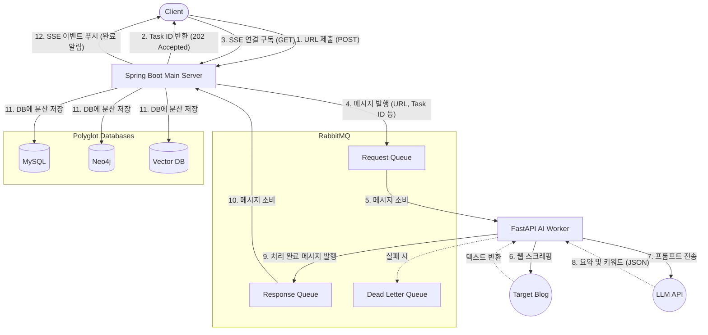

# 아키텍처

## 1) Flow Chart



## 2) 시스템 주요 구성 요소 (Components)

- **클라이언트 (Web/App):** 사용자가 공부할 블로그 URL을 입력하고, 학습 추천이나 지식 트리 결과를 시각적으로 확인하는 프론트엔드입니다.
- **Spring Boot (메인 API 서버):** 비즈니스 로직의 중심(오케스트레이터)입니다. 클라이언트와의 통신, 로그인 인증, DB 트랜잭션 관리, 데이터 조립 및 최종 저장을 담당합니다. 무거운 작업은 직접 하지 않고 위임합니다.
- **FastAPI (AI 워커 서버):** 무거운 I/O 작업인 웹 스크래핑과 파이썬 생태계에 최적화된 LLM(대규모 언어 모델) 통신을 전담하는 백그라운드 작업자입니다.
- **RabbitMQ (메시지 브로커):** Spring과 FastAPI 사이를 느슨하게 연결해 주는 우체국 역할입니다. 트래픽이 몰려도 서버가 뻗지 않도록 요청을 줄 세워두는 큐(Queue)를 관리합니다.
    
    https://velog.io/@jh0131/RabbitMQ ← 정환의 RabbitMQ 핵심 압축본
    
- **Polyglot DB (a.k.a 다른 종류의 DB 모음):**
    - **MySQL:** 사용자 정보, URL, 요약본 텍스트 등 기본적인 메타데이터를 저장합니다.
    - **Neo4j:** 대분류 ➡️ 중분류 ➡️ 소분류로 이어지는 키워드 관계와 추천 로직을 위한 지식 트리(Knowledge Tree) 그래프를 저장합니다.
    - **Vector DB:** LLM이 키워드 추출을 잘못했을 때나 유사도 검색을 위해 요약본의 임베딩(벡터화된 수치)을 저장합니다.

## 3) 전체 비동기 처리 파이프라인 (Data Flow)

작업이 시작되고 끝날 때까지의 흐름은 다음과 같은 7단계로 이루어집니다.

1. **작업 요청 및 접수 (Client ➡️ Spring):** 클라이언트가 Spring 서버로 분석할 블로그 URL을 전송합니다. Spring은 이 요청을 받자마자 작업 고유 번호(`Task ID`)를 생성해 즉시 클라이언트에게 "접수 완료" 응답(`202 Accepted`)과 함께 반환합니다.
2. **SSE 연결 대기 (Client ➡️ Spring):** 클라이언트는 방금 받은 `Task ID`를 가지고 Spring 서버에 SSE(Server-Sent Events) 연결을 요청합니다. Spring은 이 연결을 메모리에 유지한 채로 백그라운드 작업이 끝나길 기다립니다.
3. **메시지 발행 (Spring ➡️ RabbitMQ):** Spring은 스크래핑할 `URL`, `Task ID`, 그리고 지식 트리의 현재 `대/중/소 분류` 컨텍스트를 하나로 묶어 RabbitMQ의 **요청 큐(Request Queue)**에 던져 넣습니다.
4. **스크래핑 및 AI 처리 (FastAPI ➡️ Target / LLM):** FastAPI 서버가 요청 큐에서 메시지를 꺼내옵니다. 해당 URL의 블로그에 접속해 텍스트를 스크래핑(크롤링)한 뒤, 추출된 텍스트와 분류 컨텍스트를 LLM에 프롬프트로 전송합니다. LLM은 요약본과 대/중/소 키워드를 JSON 형태로 반환합니다.
5. **처리 결과 반환 (FastAPI ➡️ RabbitMQ):** FastAPI는 처리가 완료된 결과 데이터(요약, 키워드)와 `Task ID`를 다시 묶어 RabbitMQ의 **응답 큐(Response Queue)**에 넣습니다. (만약 스크래핑이나 LLM 통신에 실패하면 에러 처리를 위해 Dead Letter Queue로 보냅니다.)
6. **데이터 조립 및 분산 저장 (Spring ➡️ DBs):** Spring 서버가 응답 큐를 지켜보다가 결과 데이터를 읽어옵니다. 각 데이터의 고유 ID를 기준으로, 텍스트는 MySQL에, 키워드 트리는 Neo4j에, 임베딩은 Vector DB에 각각 알맞게 저장하고 서로를 논리적으로 연결합니다.
7. **클라이언트 알림 (Spring ➡️ Client):** 모든 DB 저장이 완료되면, Spring은 2번 단계에서 열어두었던 SSE 연결을 통해 클라이언트에게 "작업 완료" 이벤트와 최종 결과 데이터를 밀어내듯 전송(Push)하고 연결을 깔끔하게 종료합니다.

# DB와 메시지 스키마

## 1) DB Schema

### (1) `users` (사용자 정보)

사용자의 기본 정보를 관리

| **컬럼명** | **데이터 타입** | **제약 조건** | **설명** |
| --- | --- | --- | --- |
| `user_id` | VARCHAR(36) | PK | 사용자 고유 ID (UUID) - 우리 시스템용 |
| `email` | VARCHAR(255) | UNIQUE, NOT NULL | 사용자 이메일 (소셜에서 제공받음) |
| `nickname` | VARCHAR(50) |  | 화면에 표시될 닉네임 (소셜 이름 또는 자동생성) |
| `provider` | VARCHAR(20) | NOT NULL | 소셜 로그인 제공자 (예: `google`, `github`) |
| `provider_id` | VARCHAR(255) | NOT NULL | 소셜 서비스에서 발급한 해당 유저의 고유 식별자 |
| `career_goal` | VARCHAR(100) | Nullable | 희망 진로 (추천 가중치용, 가입 후 추가 입력) |
| `created_at` | DATETIME |  | 최초 가입일 |

### (2) `tasks` (비동기 작업 추적)

Spring이 발급한 `task_id`의 상태를 기록합니다. SSE 연결이 끊어지더라도 사용자는 나중에 이 테이블을 조회하여 작업이 어떻게 되었는지 확인할 수 있습니다.

| **컬럼명** | **데이터 타입** | **제약 조건** | **설명** |
| --- | --- | --- | --- |
| `task_id` | VARCHAR(36) | PK | 작업 고유 ID (UUID) |
| `user_id` | VARCHAR(36) | FK | 요청한 사용자 ID (`users` 테이블 참조) |
| `source_url` | VARCHAR(500) |  | 분석을 요청한 대상 블로그 URL |
| `status` | VARCHAR(20) |  | 현재 상태 (PENDING / PROCESSING / COMPLETED / FAILED) |
| `error_message` | TEXT | Nullable | 실패 시 원인 기록 (예: "스크래핑 차단됨") |
| `created_at` | DATETIME |  | 작업 요청 시간 |
| `updated_at` | DATETIME |  | 상태가 마지막으로 변경된 시간 |

### (3) `summaries` (최종 요약 결과)

LLM이 성공적으로 만들어낸 요약본과 URL만 깔끔하게 저장합니다. `task_id`를 외래키로 두어 어떤 작업을 통해 생성된 요약인지 추적합니다.

| **컬럼명** | **데이터 타입** | **제약 조건** | **설명** |
| --- | --- | --- | --- |
| `summary_id` | VARCHAR(36) | PK | 요약본 고유 ID (UUID) - Neo4j, VectorDB 연결 키 |
| `task_id` | VARCHAR(36) | FK, UNIQUE | 이 요약을 생성해 낸 작업 ID (`tasks` 테이블 참조) |
| `user_id` | VARCHAR(36) | FK | 소유자 ID (`users` 테이블 참조) |
| `source_url` | VARCHAR(500) |  | 원본 블로그 URL (역정규화하여 빠른 접근 지원) |
| `content` | TEXT |  | LLM이 생성한 요약 텍스트 |
| `created_at` | DATETIME |  | 요약 생성일 |

## 2) Neo4j 스키마

사용자마다 독립적인 트리를 가지려면 가장 확실한 방법은 **모든 분류 노드(Category, Topic, Keyword)에 `user_id` 속성을 부여하는 것**

### (1) 노드

| **노드 라벨 (Label)** | **주요 속성 (Properties)** | **설명 및 격리 전략** |
| --- | --- | --- |
| `User` | `user_id` (String, PK) | 트리의 최상위 뿌리(Root) 역할을 합니다. |
| `Category` | `name` (String)
`user_id` (String) | **[개인화]** 특정 사용자의 대분류. (예: `name:'Backend', user_id:'A'`) |
| `Topic` | `name` (String)
`user_id` (String) | **[개인화]** 특정 사용자의 중분류. |
| `Keyword` | `name` (String)
`user_id` (String) | **[개인화]** 특정 사용자의 소분류 키워드. |
| `Summary` | `summary_id` (String, PK) | **[다중 연결]** UUID로 고유하므로 `user_id`가 없어도 되지만, 빠른 쿼리를 위해 포함해도 좋습니다. |

### (2) Relationship 설계

```
(User)-[:OWNS_CATEGORY]->(Category)
(Category)-[:HAS_TOPIC]->(Topic)
(Topic)-[:HAS_KEYWORD]->(Keyword)

// 🌟 핵심: 하나의 Keyword 노드에서 여러 방향으로 화살표가 뻗어나감 (1:N 구조)
(Keyword)-[:CONTAINS_SUMMARY]->(Summary A)
(Keyword)-[:CONTAINS_SUMMARY]->(Summary B)
(Keyword)-[:CONTAINS_SUMMARY]->(Summary C)
```

### 추가) Cypher 쿼리

### 1. 특정 사용자의 트리에 요약본 추가하기

Cypher

`// 1. 사용자 확인
MATCH (u:User {user_id: 'user-123'})

// 2. 대/중/소 노드를 해당 user_id 전용으로 MERGE (없으면 생성)
MERGE (c:Category {name: 'Backend', user_id: 'user-123'})
MERGE (u)-[:OWNS_CATEGORY]->(c)

MERGE (t:Topic {name: 'Database', user_id: 'user-123'})
MERGE (c)-[:HAS_TOPIC]->(t)

MERGE (k:Keyword {name: 'Transaction', user_id: 'user-123'})
MERGE (t)-[:HAS_KEYWORD]->(k)

// 3. 요약본 노드 생성 및 키워드에 연결
// 이미 Keyword 노드가 존재한다면, 이 쿼리는 기존 노드에 새로운 화살표(관계)만 하나 더 추가합니다.
MERGE (s:Summary {summary_id: 'summary-uuid-999'})
MERGE (k)-[:CONTAINS_SUMMARY]->(s)`

이렇게 구성하면 `Transaction` 이라는 하나의 키워드 노드에 `summary-uuid-999`, `summary-uuid-888` 등 요약본이 무한대로 매달릴 수 있게 됩니다.

### ✅ 2. 특정 사용자의 전체 지식 트리 조회 (프론트엔드 시각화용)

클라이언트 화면에 해당 유저만의 마인드맵/트리를 그려주기 위해 데이터를 싹 긁어오는 쿼리입니다. `user_id`가 명확히 박혀있어 남의 데이터가 노출될 위험이 0%입니다.

Cypher

`MATCH (c:Category {user_id: 'user-123'})-[:HAS_TOPIC]->(t:Topic)-[:HAS_KEYWORD]->(k:Keyword)-[:CONTAINS_SUMMARY]->(s:Summary)
RETURN c.name AS Category, t.name AS Topic, k.name AS Keyword, collect(s.summary_id) AS Summaries`

*(결과: Backend -> Database -> Transaction -> [요약본A, 요약본B, 요약본C] 형태로 깔끔하게 반환됩니다.)*

## 3) Message Payload 규칙 (RabbitMQ에 넣을거)

### (1) Request Payload (Spring → Request Queue)

context에는 해당 유저의 Category/ Topic/ Keyword가 들어있음.

```json
{
  "task_id": "550e8400-e29b-41d4-a716-446655440000",
  "user_id": "a1b2c3d4-e5f6-7890-1234-56789abcdef0",
  "career_goal": "AI Engineer",
  "source_url": "https://velog.io/@example/spring-transaction-isolation"
	"context": {
    "Backend": {
      "Database": ["Transaction Isolation", "JPA 영속성", "Index"],
      "Network": ["TCP/IP", "HTTP/2"],
      "Architecture": ["MSA", "Event-Driven"]
    },
    "Frontend": {
      "React": ["Hooks", "Virtual DOM"],
      "Performance": ["LightHouse"]
    }
  }
}
```

### (2) Response Payload (FastAPI → Response Queue)

1. `"status": "SUCCESS"` : 본문 요약 성공 and 키워드 추출 성공

```json
{
  "task_id": "550e8400-e29b-41d4-a716-446655440000",
  "user_id": "a1b2c3d4-e5f6-7890-1234-56789abcdef0",
  "status": "SUCCESS",
  "data": {
    "summary_content": "Spring 환경에서 트랜잭션 격리 수준(Isolation Level)을 설정하는 방법과 각 수준별 발생하는 Read 현상(Dirty Read, Non-Repeatable Read, Phantom Read)에 대한 요약입니다...",
    "knowledge_tree": {
      "category": "Backend",
      "topic": "Database",
      "keyword": "Transaction Isolation" 
    }
  }
}
```

b. `"status": "PARTIAL_SUCCESS"` : 본문 요약 성공 and 키워드 추출 실패

```json
{
  "task_id": "550e8400-e29b-41d4-a716-446655440000",
  "user_id": "a1b2c3d4-e5f6-7890-1234-56789abcdef0",
  "status": "PARTIAL_SUCCESS", 
  "data": {
    "summary_content": "Spring 환경에서 트랜잭션 격리 수준을 설정하는 방법과...",
    "knowledge_tree": null  // 키워드 추출 실패 시 null 처리
  }
}
```

c. `"status": "FAILED"`  : 어떤 이유로 본문 요약 실패패

```json
{
  "task_id": "550e8400-e29b-41d4-a716-446655440000",
  "user_id": "a1b2c3d4-e5f6-7890-1234-56789abcdef0",
  "status": "FAILED",
  "error": {
    "code": "SCRAPING_BLOCKED", // code는 하고싶은대로
    "message": "해당 URL은 봇 접근을 차단하고 있어 텍스트를 추출할 수 없습니다."
  }
}
```

## 4) Vector DB

- 정환만 알면 되므로 대충 정리함
    
    ### 1. Vector DB 컬렉션(Collection) 기본 설정
    
    사용할 임베딩(Embedding) 모델에 따라 벡터의 크기(차원 수)가 결정됩니다. 가장 많이 쓰이는 OpenAI의 임베딩 모델을 기준으로 설정해 보겠습니다.
    
    - **컬렉션 이름:** `user_knowledge_summaries`
    - **Vector Dimension (차원 수):** `1536` (OpenAI `text-embedding-3-small` 기준) 또는 `768` (오픈소스 모델 기준)
    - **Distance Metric (유사도 측정 방식):** `Cosine Similarity` (문서의 맥락적 의미가 얼마나 비슷한지 비교할 때 가장 적합합니다)
    
    ---
    
    ### 2. 메타데이터(Metadata / Payload) 스키마
    
    Vector DB에 요약본 텍스트를 숫자로 변환하여 넣을 때, 꼬리표처럼 함께 붙여둘 JSON 데이터입니다. 이 메타데이터가 있어야 Fallback 로직이나 검색 필터링이 가능합니다.
    
    JSON
    
    `{
      "summary_id": "UUID",            // [핵심 키] MySQL 및 Neo4j와 연결되는 고유 ID
      "user_id": "UUID",               // [격리 키] 특정 사용자의 데이터만 검색하기 위한 필수 필드
      
      // 💡 아래 세 개는 Fallback(키워드 추출 실패 시 복원)을 위한 데이터
      "category": "Backend",           // 사용자가 정의한 대분류
      "topic": "Database",             // 사용자가 정의한 중분류
      "keyword": "Transaction"         // 사용자가 정의한 소분류 (이전 논의대로 단일 키워드 1개)
    }`
    
    ---
    
    ### 3. 실전 활용 시나리오 (Spring AI 기반 Vector DB 쿼리)
    
    설계한 스키마가 앞서 논의했던 **Fallback(키워드 추출 실패 시 복원)** 상황에서 어떻게 완벽하게 동작하는지 보여드릴게요.
    
    만약 LLM이 특정 사용자의 요약본에서 키워드를 뽑지 못해 `PARTIAL_SUCCESS` 메시지가 Spring으로 넘어왔다고 가정해 봅시다.
    
    1. **Spring AI 임베딩:** 방금 만들어진 요약 텍스트를 `1536` 차원의 벡터 배열로 변환합니다.
    2. **안전한 유사도 검색 요청 (Filter + Search):**
    Vector DB에 단순하게 "가장 비슷한 거 찾아줘"라고 하면 남의 요약본을 가져올 수 있습니다. 따라서 **`user_id` 필터**를 반드시 걸어야 합니다.JSON
        
        `// Spring AI가 Vector DB로 보내는 검색 쿼리 논리
        {
          "vector": [0.012, -0.045, 0.112, ...], // 방금 요약한 본문의 임베딩 벡터
          "top_k": 1,                            // 가장 비슷한 1개만 반환
          "filter": {
            "user_id": { "$eq": "현재_요청한_사용자_UUID" } // 🌟 타인 데이터 접근 원천 차단
          }
        }`
        
    3. **데이터 복원 및 연결:**
    Vector DB가 반환한 가장 비슷한 과거 요약본의 메타데이터(`category`, `topic`, `keyword`)를 쏙 빼옵니다. 이 값들을 사용해 Neo4j에 새 요약본 노드를 `MERGE`로 안전하게 연결해 주면 됩니다.
